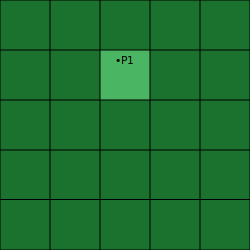
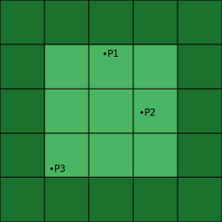

# Dynmap Image Export [](https://github.com/Virenbar/DynmapImageExport/actions/workflows/build-artifact.yml)

CLI tool for downloading tiles from Dynmap HTTP server and merging them into one image.


```text
.\DynmapImageExport <command> <url> [arguments] [options]

Commands:
    a, about                              Show info about application
    list, ls <url>                        Show available worlds and maps
    i, info <url> <world> <map>           Show info about map
    m, merge <url> <world> <map> <point>  Merge dynmap to image [default: [0,100,0]]

Arguments:
    <url>    Dynmap URL
    <world>  World name
    <map>    Map name
    <point>  Point of map [x,y,z] [default: [0,100,0]]

Options:
    -p, --padding <padding>       Padding in tiles [all]|[vert,horz]|[top,right,bottom,left] [default: [2,2,2,2]]
    -z, --zoom <zoom>             Zoom
    -o, --output <output>         Output path
    -f, --format <JPEG|PNG|WEBM>  Format
    -nc, --no-cache               Ignore cached tiles
    -t, --trace                   Write trace log
    -?, -h, --help                Show help and usage information
```

## Installation

* Install [.NET 6.x](https://dotnet.microsoft.com/download)
* Download [latest release](https://github.com/Virenbar/DynmapImageExport/releases)

## Usage

1. First see available worlds and maps

    ```text
    > .\DynmapImageExport list <url>

    Example:
    > .\DynmapImageExport ls https://map.minecrafting.ru/
    List for: https://map.minecrafting.ru/
    Available worlds and maps
    ├── world - Верхний мир
    │   ├── flat    Плоский
    │   └── se_view 3D юго-восток
    ...
    ```

2. Then available zoom levels

    ```text
    > .\DynmapImageExport info <url> <world> <map>

    Example:
    > .\DynmapImageExport i https://map.minecrafting.ru/ world flat
    Info for: https://map.minecrafting.ru/ - world - flat
    World: world - Верхний мир
    Map: flat - Плоский
    Perspective: iso_S_90_lowres PPB: 4
    Zoom levels
    ├── 0 - 4:1
    ├── 1 - 2:1
    ├── 2 - 1:1
    ├── 3 - 1:2
    ├── 4 - 1:4
    ├── 5 - 1:8
    └── 6 - 1:16
    ```

3. Make a image

    ```text
    > .\DynmapImageExport merge <url> <world> <map> [<point>...] [options]

    Example:
    > .\DynmapImageExport m https://map.minecrafting.ru/ world flat [0,100,0] -p [6,6,5,5] -z 2
    ```

Used arguments:

* `https://map.minecrafting.ru/` - Dynmap HTTP server
* `world` - World name
* `flat` - Map name
* `[0,100,0]` - Minecraft coordinates of point.
* `-p [6,6,5,5]` - Padding in tiles from points. 6 to top, 6 to right, 5 to bottom, 5 to left.  
    This will produce 12x12 tiles image(1536x1536 in pixels)
* `-z 2` - Zoom level. 1:1 scale in this example.

### Notes

* Executing without arguments will launch in interactive mode
* Default zoom is 1:1 scale (i.e. 1 block to 1 pixel)
* Size of 10Kpx X 10Kpx image ~= 150MB; 20Kpx X 20Kpx ~= 450MB

## Points and Padding example

You can provide any number of points. They will be combined into a region. Padding will be added to the resulting region.

* `[2]` - 2 in each direction  
* `[2,3]` - 2 to top and bottom, 3 to right and left  
* `[2,3,2,2]` - 2 to top, 3 to right, 2 to bottom, 2 to left
  
One point with padding `[1,2,3,2]`  
  

Three points with padding `[1]`  


## Image example

### Flat map

```console
.\DynmapImageExport m https://map.minecrafting.ru/ world flat [0,100,0] -p [6,6,5,5] -z 2
```


### Isometric map

```console
.\DynmapImageExport m https://map.minecrafting.ru/ world se_view [0,100,0] -p [5,11,5,10] -z 0
```


